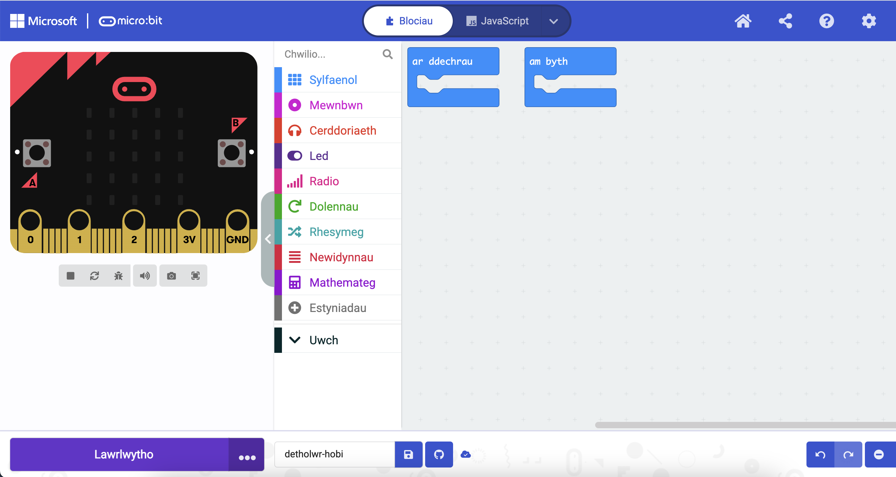

Mae golygydd **Microsoft MakeCode** yn olygydd swyddogol ar gyfer micro:bit. Mae ganddo bopeth sydd ei angen arnoch i ddechrau codio gyda'ch micro:bit.

Ar yr ochr chwith y golygydd, mae **efelychydd**. Micro:bit rhithwir yw hwn y gallwch ei ddefnyddio i brofi'ch côd.

Mae gan yr efelychydd yr holl nodweddion a botymau a geir ar micro:bit V2, gan gynnwys:
+ Arddangosfa LED
+ Seinydd
+ Meicroffon
+ Botymau mewnbwn:
    + A
    + B
    + Logo

Yng nghanol y golygydd, mae'r panel **blociau**. Mae gan y panel blociau gôd lliw ac mae'n caniatáu i chi gael mynediad at flociau côd amrywiol.

Ar ochr dde'r golygydd, mae panel golygydd **côd**. Y panel golygydd côd yw lle byddwch chi'n llusgo a gollwng blociau pan fyddwch chi'n creu eich rhaglen.

Mae panel golygydd y côd eisoes yn cynnwys dau floc: `ar y cychwyn` ac `am byth`.
