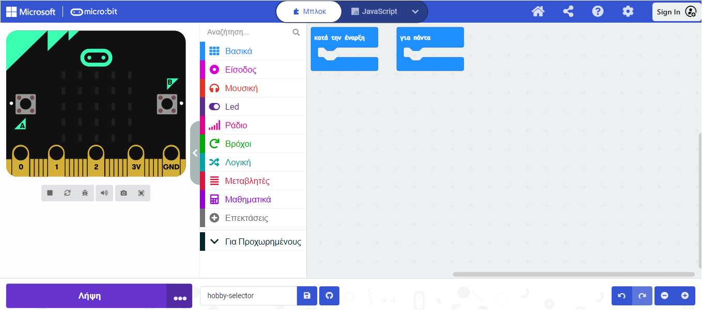

Το **Microsoft MakeCode editor** είναι επίσημο πρόγραμμα επεξεργασίας για micro:bit. Έχει όλα όσα χρειάζεσαι για να ξεκινήσεις τον προγραμματισμό με το micro:bit σου.

Στην αριστερή πλευρά του προγράμματος επεξεργασίας, υπάρχει ένας **προσομοιωτής**. Ο προσομοιωτής είναι ένα εικονικό micro:bit που μπορείς να χρησιμοποιήσεις για να δοκιμάσεις τον κώδικά σου.

Ο προσομοιωτής έχει όλα τα χαρακτηριστικά και τα κουμπιά που βρίσκονται σε ένα micro:bit V2, συμπεριλαμβανομένων:
+ Οθόνη LED
+ Ηχείο
+ Μικρόφωνο
+ Κουμπιά εισόδου:
    + A
    + B
    + Λογότυπο (Logo)

Στο κέντρο του προγράμματος επεξεργασίας, υπάρχει ο **πίνακας με τα μπλοκ**. Ο πίνακας μπλοκ είναι χρωματικά κωδικοποιημένος και σου επιτρέπει να έχεις πρόσβαση σε διάφορα μπλοκ κώδικα.

Στη δεξιά πλευρά του επεξεργαστή, υπάρχει ο **πίνακας του επεξεργαστή κώδικα**. Ο πίνακας επεξεργασίας κώδικα είναι ο χώρος όπου θα σύρεις και θα αποθέσεις μπλοκ όταν δημιουργείς το πρόγραμμά σου.

Ο πίνακας επεξεργασίας κώδικα περιέχει ήδη δύο μπλοκ: `κατά την έναρξη` και `για πάντα`.
