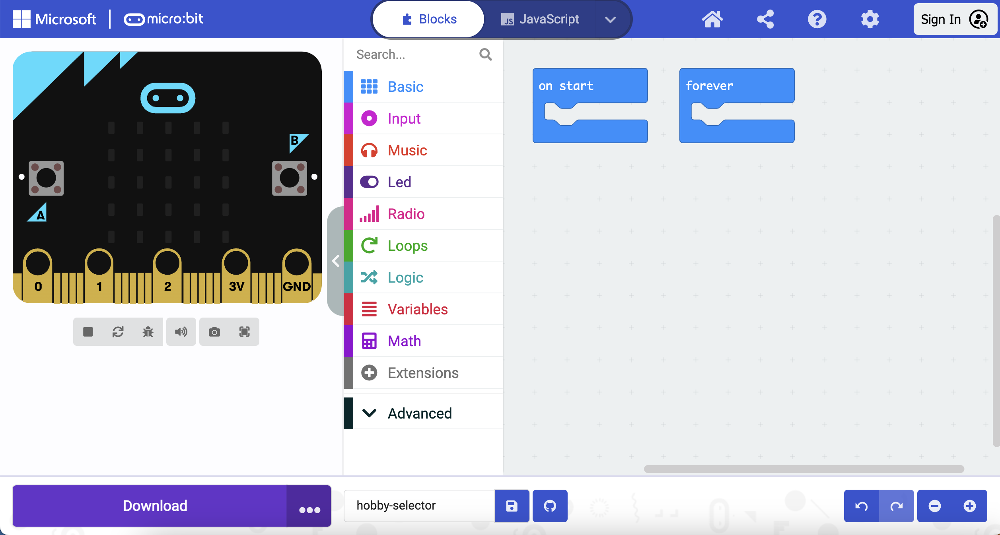

### The MakeCode Editor

Created by the micro:bit Foundation, the **MakeCode editor** has everything you need to get started coding on micro:bit. 

On the left side there is a **simulator**, this contains a virtual micro:bit that you can use to test your code! 

It has all the features and buttons found on a V2 micro:bit, including:
+ LED display
+ Speaker
+ Microphone
+ Input buttons
    + A
    + B
    + Logo

In the centre there is the **blocks panel** which is colour-coded and allows you to access various code blocks.

On the right side is the **code editor panel** to drag and drop blocks into when creating your program.

The MakeCode editor panel already contains two blocks: `on start` and `forever`.