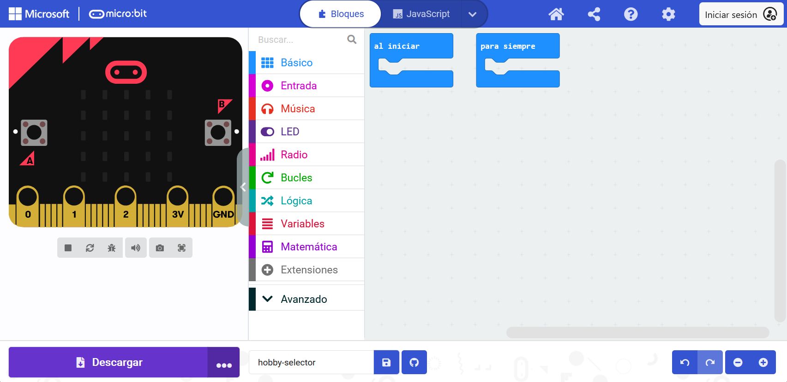

El editor **Microsoft MakeCode** es un editor oficial para micro:bit. Tiene todo lo que necesitas para empezar a programar con tu micro:bit.

En el lado izquierdo del editor hay un **simulador**. El simulador es un micro:bit virtual que puedes usar para probar tu código.

El simulador tiene todos los elementos y botones de un micro:bit V2, incluyendo:
+ Pantalla LED
+ Altavoz
+ Micrófono
+ Botones de entrada:
    + A
    + B
    + Logo

En el centro del editor se encuentra el **panel de bloques**. El panel de bloques está codificado por colores y te permite acceder varios bloques de código.

En el lado derecho del editor, está el **panel de edición de código**. El panel de edición de código es donde arrastrarás y soltarás bloques cuando estés creando tu programa.

El panel de edición de código ya tiene dos bloques: `al iniciar` y `para siempre`.
