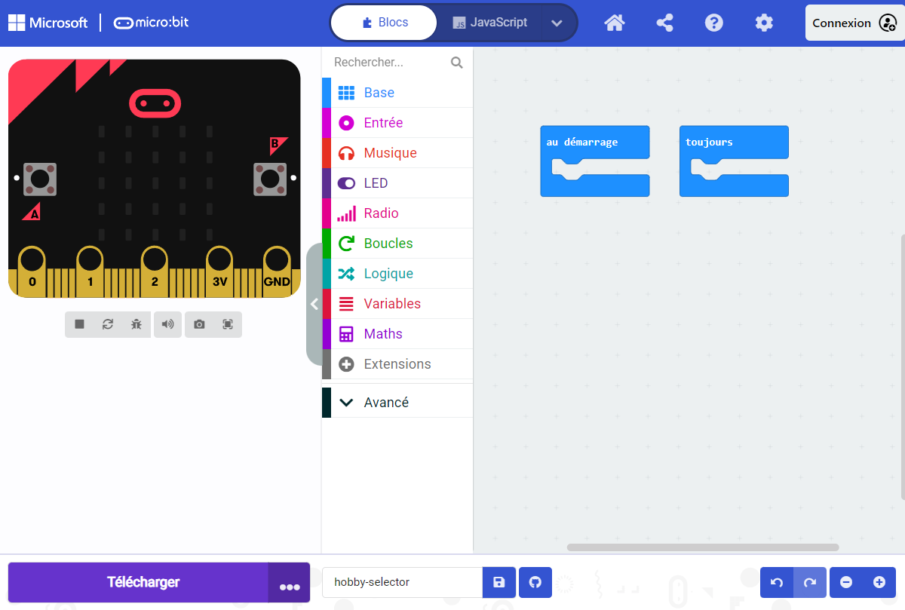

L'éditeur **Microsoft MakeCode** est un éditeur officiel pour micro:bit. Il contient tout ce dont tu as besoin pour commencer à coder avec ton micro:bit.

Sur le côté gauche de l'éditeur, il y a un **simulateur**. Le simulateur est un micro:bit virtuel que tu peux utiliser pour tester ton code.

Le simulateur a toutes les fonctionnalités et les boutons trouvés sur un micro:bit V2, y compris :
+ Écran LED
+ Haut-parleur
+ Microphone
+ Boutons de saisie :
    + A
    + B
    + Logo

Au centre de l'éditeur se trouve le panneau **blocs**. Le panneau des blocs est codé par couleur et te permet d'accéder à différents blocs de code.

Sur le côté droit de l'éditeur, il y a le panneau **éditeur de code**. Le panneau de l'éditeur de code est l'endroit où tu vas glisser-déposer des blocs lorsque tu crées ton programme.

Le panneau de l'éditeur de code contient déjà deux blocs : `au démarrage` et `toujours`.
