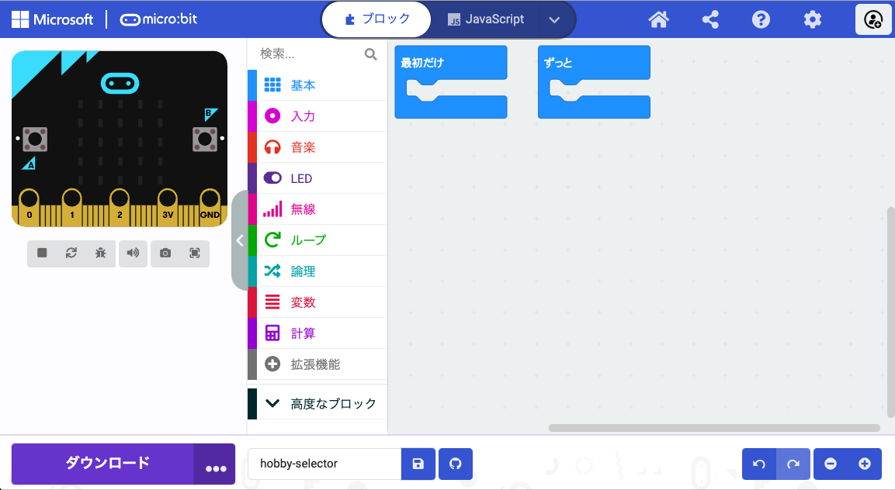

**Microsoft MakeCode エディター** は、micro:bit の公式エディターです。 micro:bitを使ってプログラミングを始めるのに必要なものはすべて揃っています。

エディターの左側には、 **シミュレーター**があります。 シミュレーターは、コードをテストするために使用できる仮想 micro:bit です。

シミュレーターには、以下を含むmicro:bit V2 にあるすべての機能とボタンが備わっています。
+ LEDディスプレイ
+ スピーカー
+ マイク
+ 以下の入力ボタン:
    + A
    + B
    + ロゴ

エディターの中央には、 **ブロック パネル**があります。 ブロック パネルは色分けされており、さまざまなコード ブロックにアクセスできます。

エディターの右側には、 **コード エディター パネル**があります。 コード エディター パネルは、プログラムを作成するときにブロックをドラッグ アンド ドロップする場所です。

コードエディタパネルには、 `最初だけ` と `ずっと`の2つのブロックが含まれています。
