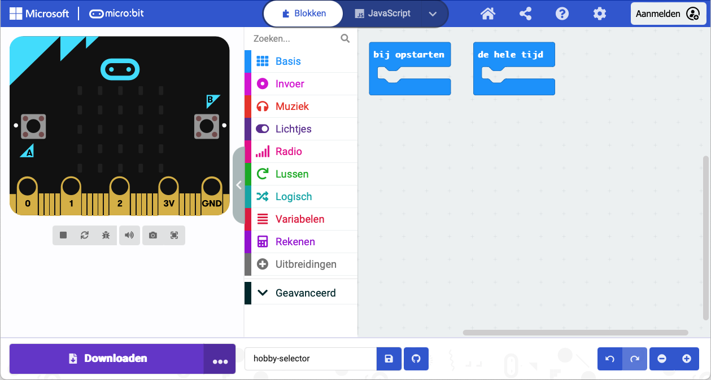

De **Microsoft MakeCode editor** is een officiële editor voor micro:bit. Het heeft alles wat je nodig hebt om te beginnen met coderen met je micro:bit.

Aan de linkerkant van de editor is er een **simulator**. De simulator is een virtuele micro:bit die je kunt gebruiken om je code te testen.

De simulator heeft alle functies en knoppen die je op een micro:bit V2 vindt, waaronder:
+ LED scherm
+ Luidspreker
+ Microfoon
+ Invoerknoppen:
    + A
    + B
    + Logo

In het midden van de editor staat het paneel **blokken**. Het blokken paneel is kleurgecodeerd en geeft je toegang tot verschillende codeblokken.

Aan de rechterkant van de editor is het **bewerkingspaneel**. Het bewerkingspaneel is de plek waar je blokken naar toe sleept en neerzet als je jouw programma maakt.

Het bewerkingspaneel bevat al twee blokken: `bij opstarten` en `de hele tijd`.
